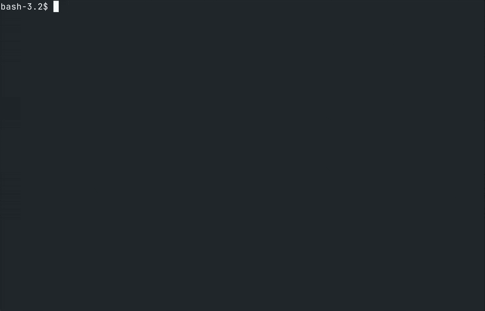

<p align="center">
  <a href="https://opencode.ai">
    <picture>
      <source srcset="packages/console/app/src/asset/logo-ornate-dark.svg" media="(prefers-color-scheme: dark)">
      <source srcset="packages/console/app/src/asset/logo-ornate-light.svg" media="(prefers-color-scheme: light)">
      
    </picture>
  </a>
</p>
<p align="center">The open source AI coding agent.</p>
<p align="center">
  <a href="https://opencode.ai/discord"></a>
  <a href="https://www.npmjs.com/package/opencode-ai"></a>
  <a href="https://github.com/sst/opencode/actions/workflows/publish.yml"></a>
</p>

---

## 🔒 Protected Mode Fork

> **This is a fork of OpenCode that implements Protected Mode** - a macOS security feature that uses kernel-level file protection to prevent AI agents from accessing sensitive credentials and files.

### Problem

AI agents in OpenCode have full filesystem access, creating security risks for credentials and sensitive files. Recent vulnerabilities demonstrate that prompt-level protections are insufficient to prevent AI from accessing and leaking credentials.

### Solution

Protected Mode uses **Unix file permissions to enforce file restrictions at the kernel level**. Commands run as a restricted user (`opencode-agent`) that cannot read protected files. Even if prompt injection succeeds, the OS blocks unauthorized access before data is read.

### Demo



### Commands

```bash
opencode protect setup
```

Creates the opencode-agent user, initializes `~/.opencode/security.json`, configures sudo rules.

```bash
opencode protect lock
```

Applies protections to files specified in security.json.

```bash
opencode protect status
```

Shows currently protected files and security configuration state.

### How It Works

#### File Protection via Unix Permissions

Users specify sensitive files in `~/.opencode/security.json`. The setup modifies file permissions (`chmod 600`) to make files owner-only readable, preventing the opencode-agent user from accessing them. These restrictions are enforced at the kernel level—even successful prompt injection cannot bypass OS security.

#### Command Whitelisting

Development commands may be run via a sudo wrapper with explicit allow-lists. This is particularly important for commands like git which enforce particular permissions. Users can configure which commands the agent can run without additional restrictions, balancing security with workflow convenience.